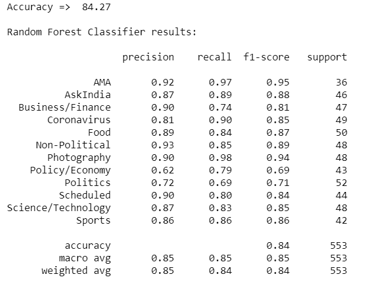
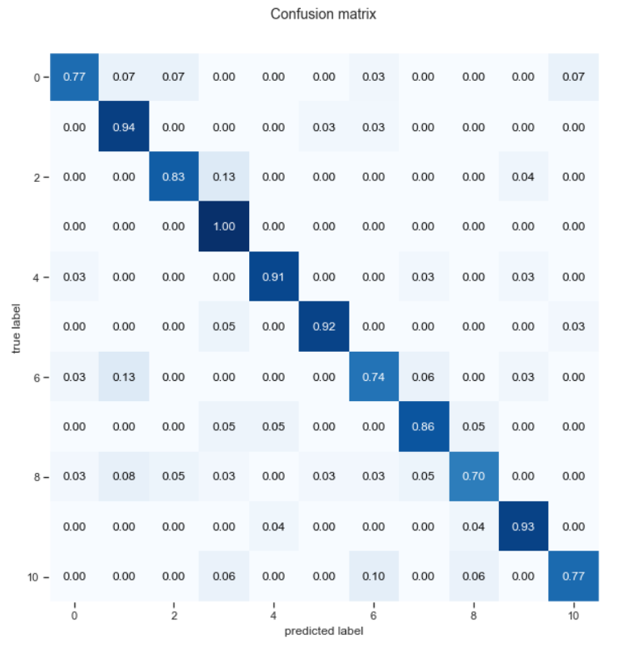

# Overview
> After traning on multiple algorithm we came to this conclution.  
> Random Forest Classifier has best Accuracy with Title + Body + Comments as Input feature.
*** 
| Model | Title | Body | Comments | Title + Body + Comments|
|-|-|-|-|-|
|Multinomial Naive Bayes | 64.92|33.27|40.69|69.44|
|Logistic Regression |68.72|38.16|41.77|79.57|
| Random Forest|69.26|42.13|42.86|84.27|
|Support Vector Machine |66.73| 35.26|41.05|74.14|
***
## Random Forest Classifer.

***
## Next Improvement.
> Implement NLP using Bidirectional RNN.  
> Implement BERT.  
Required Large amount of Data.
