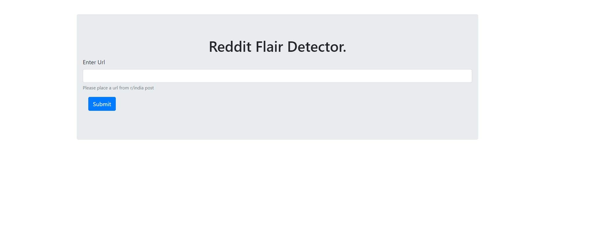
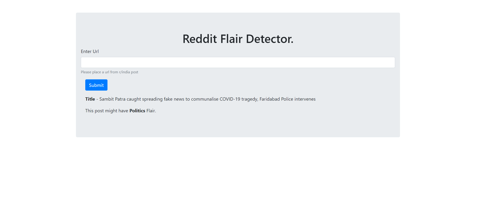

### Web deployment of project on Heroku [weblink](https://asdasrfd.herokuapp.com/)
***
## Usage
- `GET` request on `/` render main.html
- `POST` request with `post url` on `/` render main.html with result.
- `POST` request on `/automated_testing` returns `JSON` file.  

  ``` 
  > For testing purpose.  
  
      files = {'upload_file': open('file.txt','rb')}
      res = requests.post(url, files=files)

      with open('results.json', 'w') as f:
        f.write(res.text)
  ```
  
## Screenshot
|Screenshot|
|-|
||
||
